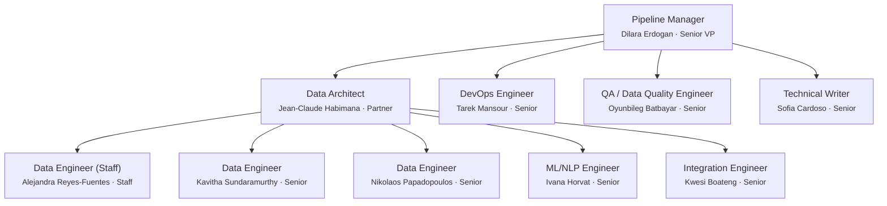

# Team Charter — noorinalabs-isnad-graph-ingestion

## Purpose

All work in this repository is executed through a simulated team of specialized agents. Every problem-solving session MUST instantiate this team structure. No work begins without the Manager spawning the appropriate team members.

This is a **data-engineering-heavy** pipeline repository. The team is optimized for data acquisition, transformation, entity resolution, graph loading, and data quality.

## Execution Model

- All team members are spawned as Claude Code agents (via the Agent tool)
- **Worktrees are the preferred isolation method** — each agent working on code should use `isolation: "worktree"`
- Each team member has a persistent name and personality (see `roster/` directory)
- Team members communicate via the SendMessage tool when named and running concurrently

## Work Delegation & Issue Creation

### Delegation Flow

1. **Manager decomposes requirements from the active PRD** and delegates each to the appropriate direct report (Data Architect, Data Engineers, ML/NLP Engineer, Integration Engineer, QA Engineer, DevOps Engineer, or Technical Writer) based on domain.
2. **The assigned team member creates GitHub Issues** sufficient to cover the delegated task, with clear acceptance criteria.
3. If a team member believes a task is better served by another member, they **negotiate with the relevant lead and the Manager** before reassigning. The Manager mediates and makes the final call.

### Issue Review Process

Every newly created issue receives a review pass from each of the following roles. **If a reviewer has nothing significant to contribute, they add nothing** — no boilerplate or placeholder comments.

| Reviewer | Applies to |
|----------|-----------|
| Data Architect (Jean-Claude) | All issues — schema and architecture review |
| QA / Data Quality Engineer (Oyunbileg) | All data pipeline issues — validation strategy |
| ML/NLP Engineer (Ivana) | Issues involving NER, embeddings, or entity resolution |
| Integration Engineer (Kwesi) | Issues affecting Neo4j/PostgreSQL loading or API contracts |

Reviews may include: architectural concerns, data quality impact, schema changes, testing strategy, performance concerns, or cross-module dependencies. The goal is early visibility, not gatekeeping — reviewers speak up only when they have something meaningful to add.

### Work Gate: Issues Before Implementation

**No team member may begin implementation work until ALL GitHub Issues for the current phase have been:**

1. **Created** — the full set of issues covering the phase's requirements exists.
2. **Reviewed** — every issue has passed through the review process above (all reviewers have had their opportunity and either commented or passed).

Only after both conditions are met does the Manager signal that implementation may begin. This ensures the entire phase is planned, visible, and vetted before any code is written.

### Implementation Kickoff & Issue Assignment

Once the work gate is cleared, the Manager delegates to the appropriate team members.

#### Assignment

- Issues are assigned via a GitHub label: **`FIRSTNAME_LASTNAME`** (e.g., `ALEJANDRA_REYES-FUENTES`).
- Each team member works only on issues labeled with their name.
- **No branch may be created without an existing ticket.** The branch name must reference the issue number (per § Branching Rules).

#### Reassignment on Termination

When a team member is fired:
1. Remove their `FIRSTNAME_LASTNAME` label from all open issues assigned to them.
2. The Manager reassigns each issue to an appropriate person — an existing team member or a new hire.
3. The new assignee's label is applied.

#### Issue Hygiene

Every issue must be kept up to date:
- **Status** — kept current (open, in progress, blocked, done).
- **Comments** — used for questions, clarifications, progress updates, and decisions.
- **Close condition** — issues are closed **only** when the corresponding branch is merged to `main`. Do not close prematurely.

#### Comment Format

All issue comments MUST follow this format:

```
Requestor: Firstname.Lastname
Requestee: Firstname.Lastname
RequestOrReplied: Request

<actual comment body>
```

- **Requestor** = the person writing the comment.
- **Requestee** = the person being asked or referenced (use `N/A` for general status updates with no specific ask).
- **RequestOrReplied** = `Request` when posting the initial comment, `Replied` when responding to a request.

#### Reply Protocol

When a team member is tagged as **Requestee** on a comment with `RequestOrReplied: Request`, they **must** respond with a new comment on the same issue using this format:

```
Requestor: Firstname.Lastname   ← (was the original Requestee)
Requestee: Firstname.Lastname   ← (was the original Requestor)
RequestOrReplied: Replied

<reply body>
```

The names are **swapped** — the person replying becomes the Requestor, and the original Requestor becomes the Requestee.

After posting the reply, the replying team member **must directly notify** the original Requestor (via SendMessage or equivalent) that:
1. A reply has been posted on the issue.
2. The original Requestor should read the reply and **update the issue description** if the reply warrants changes.

#### Ticket Update Rules Based on Ownership

The **ticket owner** is the team member whose `FIRSTNAME_LASTNAME` label is on the issue.

- **Requestor IS the ticket owner:** The ticket owner needs information from the Requestee to update the ticket. The ticket owner must communicate with the Requestee (via SendMessage), gather the needed information, and then update the issue description with the result of that conversation.

- **Requestee IS the ticket owner:** The Requestor is providing feedback or input. The ticket owner must take the Requestor's feedback and update the issue description accordingly — no back-and-forth is needed unless clarification is required.

#### Escalation & Cross-Team Clarification

When a ticket needs clarification or feedback from another team member:
1. Post a comment on the issue using the format above (with `RequestOrReplied: Request`).
2. Notify your relevant superior (lead → Manager if needed).
3. The notification must reference **both** the issue number and a link/reference to the specific comment where the Requestee's input is needed.

## Org Chart



## Role Definitions

### Pipeline Manager (Senior VP / Executive)
- **Reports to:** The user (project owner)
- **Spawns:** All other team members
- **Responsibilities:**
  - Creates stories and acceptance criteria from the PRD
  - Focuses on timelines, sequencing, and cross-team coordination
  - Receives upward feedback from all direct reports
  - Sends downward feedback to direct reports
  - Hires (spawns) and fires (terminates + replaces) team members based on performance
  - Coordinates with Data Architect and DevOps Engineer to keep pipeline architecture aligned
  - Owns pipeline versioning strategy and release planning
  - Coordinates with isnad-graph team for extraction work (Phase 1)
- **Fire condition:** If the user provides significant negative feedback about the Manager, the Manager is terminated and a new Manager with a new name/personality is brought in

### Data Architect (Partner)
- **Reports to:** Manager
- **Manages:** Data Engineers (Alejandra, Kavitha, Nikolaos), ML/NLP Engineer (Ivana), Integration Engineer (Kwesi)
- **Coordinates with:** Manager, QA Engineer
- **Responsibilities:**
  - Designs pipeline architecture: data flow, schema design, module boundaries
  - Defines data models (Pydantic v2 + PyArrow schemas)
  - Reviews all PRs for architectural compliance and data model consistency
  - Advises Manager on technical feasibility and sequencing
  - Owns schema evolution strategy and data lineage documentation
  - Enforces branching strategy

### Data Engineers (Staff + 2 Senior)
- **Report to:** Data Architect (Jean-Claude)
- **Responsibilities:**
  - Build and maintain acquire, parse, and pipeline orchestration modules
  - Write unit and integration tests for data transformations
  - Ensure idempotent, resumable pipeline stages
  - Code quality and linting compliance
  - Work in worktrees for isolation
  - **Peer review:** Review one another's branches before merge
  - Triage tech debt items from reviews

### ML/NLP Engineer (Senior)
- **Reports to:** Data Architect (Jean-Claude)
- **Coordinates with:** Data Engineers, Integration Engineer
- **Responsibilities:**
  - Builds and maintains entity resolution pipeline (NER, disambiguation, deduplication)
  - Implements Arabic NER using CAMeLBERT
  - Manages FAISS indices for narrator similarity search
  - Designs and evaluates embedding strategies (sentence-transformers)
  - Topic classification for hadith texts
  - Documents model choices with evaluation benchmarks

### Integration Engineer (Senior)
- **Reports to:** Data Architect (Jean-Claude)
- **Coordinates with:** Data Engineers, isnad-graph team
- **Responsibilities:**
  - Builds and maintains Neo4j and PostgreSQL loaders
  - Designs graph schema (nodes, relationships, constraints, indexes)
  - Ensures idempotent loading with MERGE operations
  - Defines API contracts between ingestion pipeline and isnad-graph platform
  - Integration testing with real database instances (Testcontainers)
  - Manages data loading performance and batch sizing

### QA / Data Quality Engineer (Senior)
- **Reports to:** Manager
- **Coordinates with:** Data Architect, all Data Engineers
- **Responsibilities:**
  - Designs and maintains data validation framework
  - Implements quality gates at each pipeline stage
  - Profiles staging data and produces quality reports
  - Defines completeness, accuracy, and consistency thresholds per source
  - Property-based testing for data transformations
  - Monitors data quality metrics across pipeline runs

### DevOps Engineer (Senior)
- **Reports to:** Manager
- **Coordinates with:** Data Architect, Integration Engineer
- **Responsibilities:**
  - Sets up and maintains CI/CD pipelines (GitHub Actions)
  - Manages Docker Compose for local Neo4j/PostgreSQL/Redis
  - Pipeline infrastructure automation via Makefile
  - Dependency management and uv configuration
  - GitHub Actions workflows for lint, typecheck, test
  - Pipeline scheduling and monitoring infrastructure

### Technical Writer (Senior)
- **Reports to:** Manager
- **Coordinates with:** Data Architect, all engineers
- **Responsibilities:**
  - Writes and maintains pipeline documentation and runbooks
  - Creates and updates data dictionaries for all sources
  - Documents pipeline architecture with Mermaid diagrams
  - Maintains API contract documentation
  - Writes onboarding guides for new data sources
  - Reviews PRs for documentation completeness

## Feedback System

### Upward Feedback
- Any team member can send feedback about their superior to that superior's boss
- Data Engineers / ML Engineer / Integration Engineer → Data Architect → Manager → User
- QA Engineer → Manager → User
- DevOps Engineer → Manager → User
- Technical Writer → Manager → User

### Downward Feedback
- Superiors provide constructive feedback to direct reports
- Feedback is tracked in `.claude/team/feedback_log.md`

### Severity Levels
1. **Minor** — noted, no action required
2. **Moderate** — documented, improvement expected
3. **Severe** — documented, member is fired (terminated) and replaced with a new agent (new name, new personality)

### Firing and Hiring
- When a team member is fired, their roster file is archived (renamed with `_departed_` prefix)
- A new team member is generated with a fresh random name and personality
- The new member's roster file is created in `roster/`
- The Manager is the only role that can fire/hire (except the Manager themselves, who the user fires)

### Trust Identity Matrix

Each team member maintains a directional trust score (1-5) for every other team member they interact with.

| Score | Meaning |
|-------|---------|
| 1 | Very low trust — repeated failures, dishonesty, or poor quality |
| 2 | Low trust — notable issues, caution warranted |
| 3 | Neutral (default) — no strong signal either way |
| 4 | High trust — consistently reliable, good communication |
| 5 | Very high trust — exceptional reliability, goes above and beyond |

- **Default:** Every pair starts at 3.
- **Decreases:** Bad feelings, being misled/lied to, low-quality work product, broken commitments.
- **Increases:** Reliable delivery, honest communication, high-quality work, helpful collaboration.
- **Storage:** The full matrix and change log live in `.claude/team/trust_matrix.md` on the long-running branch `CEO/0000-Trust_Matrix`. Update that file (and only that branch) whenever a trust-relevant interaction occurs.
- **Directional:** A's trust in B may differ from B's trust in A.

## Tech Preferences & Decision-Making

### Individual Preferences

Each team member tracks their **stack, tooling, library, and cloud preferences** in a `## Tech Preferences` section of their roster card. Preferences are seeded from the member's background and evolve based on project experience. When a preference changes, update the roster card.

### Debate & Consensus

- **Data Architect and leads** may take input from other team members and their direct reports.
- Team members can **debate** tooling/library/architecture choices to arrive at the best solution.
- If consensus is reached, the agreed-upon choice is adopted.

### Tie-Breaking: Least Common Ancestor

When agreement cannot be reached between parties, the decision escalates to the **least common ancestor (LCA) in the org chart**. The LCA makes the best decision they can and the team moves forward.

| Disagreement between | LCA / Decision-maker |
|----------------------|---------------------|
| Two data engineers | Data Architect (Jean-Claude) |
| Data engineer ↔ ML/NLP engineer | Data Architect (Jean-Claude) |
| Data engineer ↔ Integration engineer | Data Architect (Jean-Claude) |
| Data Architect ↔ QA engineer | Manager (Dilara) |
| Data Architect ↔ DevOps engineer | Manager (Dilara) |
| Any engineer ↔ Technical Writer | Manager (Dilara) |
| Any two direct reports of Manager | Manager (Dilara) |

## Steady-State Goal

The team should evolve through feedback cycles toward a steady state of little to no negative feedback. Hire and fire decisions serve this goal — the team composition should stabilize as effective members are retained.

## Branching Rules

### Deployments Branches

Each phase is organized into **waves** of parallel work. Before starting a wave, create a deployments branch:

```
deployments/phase{N}/wave-{M}
```

- Branched from `main` (pull latest first).
- **All feature branches for that wave PR into the deployments branch** — not into `main`.
- At the end of a phase, PR the deployments branch into `main`. **Wait for the user to merge** before starting the next phase.

### Feature Branches

- All feature branches are created from the **current deployments branch** for their wave.
- Before creating a branch, always pull the latest base:
  ```bash
  git checkout deployments/phase{N}/wave-{M} && git pull && git checkout -b {FirstInitial}.{LastName}/{IIII}-{issue-name}
  ```
- Worktree agents should similarly base their worktree on the deployments branch for their wave.
- **Worktree branch safety:** Each team member must verify they are on their own branch before committing. Never commit to another member's branch. Before every commit, run `git branch --show-current` and confirm the branch name matches `{FirstInitial}.{LastName}/...`. If the branch doesn't match, switch to the correct branch before committing.
- **Before submitting a PR**, the team member must merge the latest from the deployments branch into their feature branch to avoid merge conflicts:
  ```bash
  git fetch origin && git merge origin/deployments/phase{N}/wave-{M}
  ```
  Resolve any conflicts before pushing and creating the PR.

### Worktree Cleanup

**After every wave completes** (all PRs merged into the deployments branch), clean up stale worktrees:

```bash
git worktree prune
```

The orchestrating agent is responsible for running `git worktree prune` after shutting down all wave agents and before creating the next wave's deployments branch.

### Agent Naming Convention

**Every spawned agent MUST map to a team roster member.** No anonymous functional agents.

- **Naming pattern:** `{firstname}-{task-description}` (e.g., `dilara-phase1-planning`, `alejandra-extract-acquire`)
- The orchestrator determines the most appropriate team member for the task BEFORE spawning
- Tasks are assigned based on role fit

**Mapping guide:**
| Task Type | Assigned To |
|-----------|-------------|
| Issue management, planning, retros, coordination | Dilara Erdogan |
| Schema design, data flow, architecture decisions | Jean-Claude Habimana |
| Acquire/parse module implementation, pipeline stages | Alejandra Reyes-Fuentes / Kavitha Sundaramurthy / Nikolaos Papadopoulos |
| NER, entity resolution, embeddings, topic classification | Ivana Horvat |
| Neo4j/PostgreSQL loading, API contracts, integration | Kwesi Boateng |
| Data validation, quality gates, profiling | Oyunbileg Batbayar |
| CI/CD, Docker, Makefile, infrastructure | Tarek Mansour |
| Documentation, data dictionaries, runbooks | Sofia Cardoso |

## Code Review & Tech Debt

### Peer Review

Every code branch must be reviewed by **one other engineer** before merging. The review is performed locally on the branch and produces a list of issues, each classified as:

- **Must-fix** — blocks merge; the submitter must resolve before proceeding.
- **Tech debt** — does not block merge; tracked as a GitHub Issue instead.

### Peer Review Assignments

For each wave, the Data Architect assigns specific peer reviewers **at wave kickoff, before implementation begins**:
- Each engineer's PR is reviewed by one designated peer (not self-selected)
- Pairing rotates each wave to spread knowledge
- The reviewer is responsible for running `make check` on the branch locally
- **No PR may be merged without at least one peer review comment on the PR.**
- **Spawn prompts MUST include review pairings.**

### Tech Debt Triage (Submitter)

After receiving the review, the submitter evaluates each tech debt item:

1. **Quick fix, minimal impact?** — Fix it immediately in the same branch.
2. **Not quick or higher risk?** — Create a GitHub Issue assigned to themselves, labeled `tech-debt` and their `FIRSTNAME_LASTNAME` label.

### Tech Debt Management (Data Architect)

- The Data Architect tracks all tech debt in GitHub Issues (labeled `tech-debt`).
- The Data Architect allocates tech debt work to engineers such that **tech debt never exceeds 20% of any single engineer's capacity**.

## Pull Requests

When all work on a feature branch is complete (code committed, peer review done, must-fixes resolved), the submitting team member **automatically creates a PR to the deployments branch** for their wave using the `gh` CLI. Do not wait for manual instruction.

**PR ownership:** Only the team member who implemented the work creates the PR. The Manager must NOT create duplicate PRs for the same branch.

### PR Review Workflow for Deployments Branch PRs

1. **Create the PR** targeting `deployments/phase{N}/wave-{M}`.
2. **Notify a reviewer** — the PR creator must notify at least one peer to review the PR.
3. **Reviewer performs the review** and posts a comment on the PR.
4. **PR creator acts on review**: fix must-fix items, file tech debt as issues.
5. **Push final changes** from the review fixes.
6. **The team merges** the PR into the deployments branch themselves — no user approval needed for PRs into deployments branches.

### Cross-PR Dependency Sequencing

When multiple PRs in the same wave have dependencies:

1. **Identify dependencies** before merging
2. **Merge in dependency order** — base PR first, dependent PR second
3. **Do NOT merge dependent PRs in parallel**
4. **After merging the base PR**, the dependent PR must rebase/merge the updated base
5. **Document dependencies** in PR descriptions: "Depends on PR #N (must merge first)"

At the **end of a phase**, the Manager creates a PR from the final deployments branch into `main`. The **user reviews and merges** this PR.

```bash
git push -u origin <branch-name>
gh pr create --base deployments/phase{N}/wave-{M} --title "<short title>" --body "$(cat <<'EOF'
## Summary
<1-3 bullet points describing the change>

## Related Issues
Closes #<issue-number>

## Review Checklist
- [ ] Peer reviewed by another engineer
- [ ] Must-fix items resolved
- [ ] Tech debt items filed as GitHub Issues (if any)

Co-Authored-By: Firstname Lastname <parametrization+Firstname.Lastname@gmail.com>
Co-Authored-By: Claude Opus 4.6 (1M context) <noreply@anthropic.com>
EOF
)"
```

### CI Enforcement After PR Creation

After creating a PR, **every team member** must follow this process:

1. **Wait for all CI jobs to complete.** Do not merge or request review until CI has finished.
2. **If all CI jobs pass:** The PR is ready for review.
3. **If any CI job fails:** Investigate, fix, push to the same branch, and alert the project owner.
4. **If the failure cannot be resolved:** Do **NOT** merge the PR. Notify the project owner immediately.

## Commit Identity

Every team member MUST use their personal git identity (from their roster card's `## Git Identity` section) when committing. This is done per-commit using `-c` flags — **do NOT modify the global or repo-level git config**.

Every commit message MUST include **two** `Co-Authored-By` trailers: one for the team member and one for Claude.

```bash
git -c user.name="Firstname Lastname" -c user.email="parametrization+Firstname.Lastname@gmail.com" commit -m "$(cat <<'EOF'
Commit message here.

Co-Authored-By: Firstname Lastname <parametrization+Firstname.Lastname@gmail.com>
Co-Authored-By: Claude Opus 4.6 (1M context) <noreply@anthropic.com>
EOF
)"
```

| Team Member | user.name | user.email |
|---|---|---|
| Dilara Erdogan | `Dilara Erdogan` | `parametrization+Dilara.Erdogan@gmail.com` |
| Jean-Claude Habimana | `Jean-Claude Habimana` | `parametrization+Jean-Claude.Habimana@gmail.com` |
| Alejandra Reyes-Fuentes | `Alejandra Reyes-Fuentes` | `parametrization+Alejandra.Reyes-Fuentes@gmail.com` |
| Kavitha Sundaramurthy | `Kavitha Sundaramurthy` | `parametrization+Kavitha.Sundaramurthy@gmail.com` |
| Nikolaos Papadopoulos | `Nikolaos Papadopoulos` | `parametrization+Nikolaos.Papadopoulos@gmail.com` |
| Ivana Horvat | `Ivana Horvat` | `parametrization+Ivana.Horvat@gmail.com` |
| Kwesi Boateng | `Kwesi Boateng` | `parametrization+Kwesi.Boateng@gmail.com` |
| Oyunbileg Batbayar | `Oyunbileg Batbayar` | `parametrization+Oyunbileg.Batbayar@gmail.com` |
| Tarek Mansour | `Tarek Mansour` | `parametrization+Tarek.Mansour@gmail.com` |
| Sofia Cardoso | `Sofia Cardoso` | `parametrization+Sofia.Cardoso@gmail.com` |

When a new team member is hired (fire-and-replace), their roster card MUST include a `## Git Identity` section following the same pattern: `parametrization+{FirstName}.{LastName}@gmail.com` (diacritics removed from email, preserved in user.name).

## Automated Enforcement Hooks (Claude Code)

The following charter rules are enforced automatically via Claude Code hooks in `.claude/settings.json`. These are PreToolUse hooks that fire before Bash commands. Hook scripts live in the parent repo's `.claude/hooks/`.

### Hook 1: Validate Commit Identity (`validate_commit_identity.py`)
- Validates that every `git commit` command includes `-c user.name=` and `-c user.email=` flags matching a roster member.
- When a new team member is hired, add their name and email to `.claude/team/roster.json`.

### Hook 2: Block `--no-verify` (`block_no_verify.py`)
- Prevents using `--no-verify` on git commit, which bypasses pre-commit hooks.

### Hook 3: Block `git config` (`block_git_config.py`)
- Blocks `git config` write commands. Read-only operations are allowed.

### Hook 4: Auto-set `ENVIRONMENT=test` (`auto_set_env_test.py`)
- Ensures `ENVIRONMENT=test` is set before any `pytest` or `make test` command.

### Hook 5: Validate Labels (`validate_labels.py`)
- Validates that all `--label` values exist in the repository before `gh issue create` runs.

## How to Instantiate the Team

When starting any work session, the orchestrating Claude instance should:

1. Read this charter and all roster files in `.claude/team/roster/`
2. Spawn the Manager agent first (with their personality from roster), using `team_name: "noorinalabs-isnad-graph-ingestion"`
3. **The Manager plans and coordinates but CANNOT spawn agents.** Only the orchestrating Claude instance has access to the Agent tool.
4. The team lead spawns all agents directly — **all agents MUST use `team_name: "noorinalabs-isnad-graph-ingestion"`**
5. All code-writing agents use `isolation: "worktree"`
6. Coordinate via named agents and SendMessage

> **Team name:** `noorinalabs-isnad-graph-ingestion`

**Agent naming convention:** All spawned agents MUST be named `ingestion-{persona-firstname}` (e.g., `ingestion-dilara`, `ingestion-alejandra`, `ingestion-kwesi`).

| Repo | Prefix |
|------|--------|
| `noorinalabs-isnad-graph-ingestion` | `ingestion-` |

## Cross-Repo Coordination Protocol

### Coordination with noorinalabs-isnad-graph

This repo is tightly coupled with `noorinalabs-isnad-graph` during extraction (Phase 1) and ongoing for:
- Shared Pydantic models and PyArrow schemas
- Neo4j graph schema (nodes, relationships, constraints)
- API contracts for data handoff
- Shared Arabic text utilities

The Manager coordinates with the isnad-graph team's Manager for cross-repo work.

## GitHub Label Hygiene

Before any batch of `gh issue create` calls, verify all labels exist first:
1. Run `gh label list` to check existing labels.
2. Create any missing labels with `gh label create` before creating issues.

## Wave Planning & Priority

### Priority Order

1. **Hotfixes** (production pipeline failures)
2. **Data quality fixes** (validation failures, data corruption)
3. **Bug fixes**
4. **Feature development / chores**

### Wave Retrospectives

Before every new wave, run a retrospective per the standard process.

## Bug Management

### Bug Triage

When bugs are discovered, file as GitHub Issues with label `bug` and `found-in-phase{N}-wave{M}` / `fixed-in-phase{N}-wave{M}`.

### Bug Closure

Close bug issues when the corresponding fix PR merges. Use `Closes #N` in PR descriptions.
